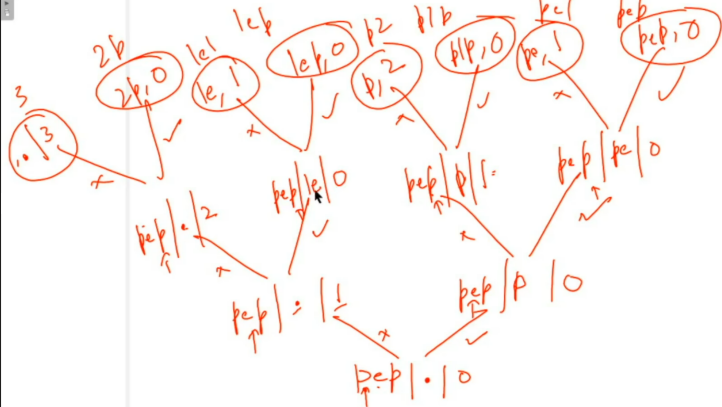

*// print Abbrivation*
*\#include* \<iostream\>
using namespace std;
*\#include* \<bits/stdc++.h\>

void solve(string s, int idx, int cnt, string psf)
{
  *if* (idx == s.size()) {
    *if* (cnt == 0) cout \<\< psf \<\< endl;
    *else* cout \<\< psf + to_string(cnt) \<\< endl;
    *return*;
  }
  *if* (cnt \> 0) solve(s, idx + 1, 0, psf + to_string(cnt) + s\[idx\]);
  *else* solve(s, idx + 1, cnt, psf + s\[idx\]);
  solve(s, idx + 1, cnt + 1, psf);
}
int main()
{
  string s = "pep";
  solve(s, 0, 0, "");
  *return* 0;
}

// Ans

pep
pe1
p1p
p2
1ep
1e1
2p
3

