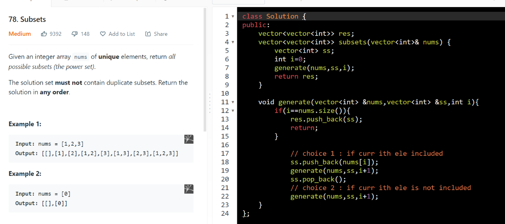
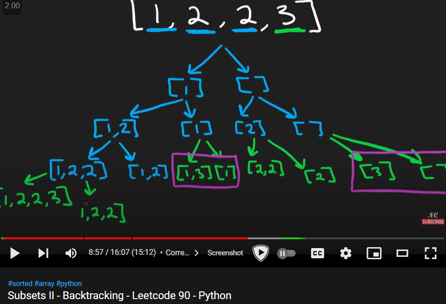
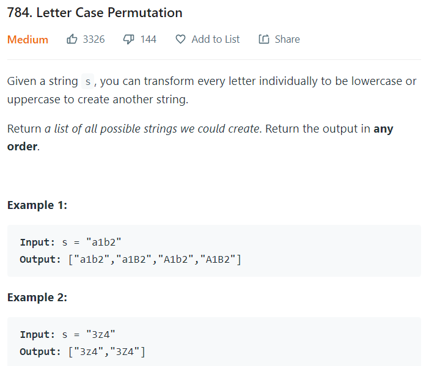
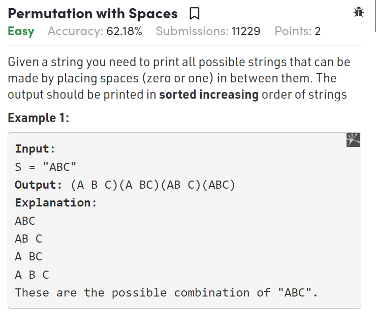
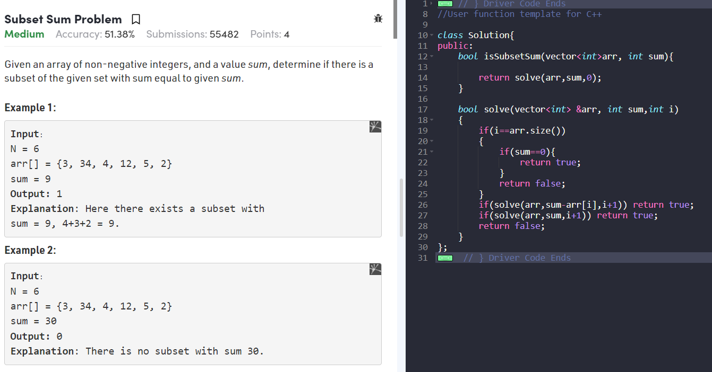

AM

=============== include or not include ===============

\# Questions
1.  Subsets ( all distinct element)
2.  Subsets II ( dublicate present )

1.  print all subsets or subsequences (distinct element)

<table>
<colgroup>
<col style="width: 100%" />
</colgroup>
<thead>
<tr class="header">
<th>
TC = (n)*(2^n)

= 2^n (how many subsets we going to have)*(n long each subset gonna be)

SC = 2^n

each ele has two choices so we will make 2^n calls
</th>
</tr>
</thead>
<tbody>
</tbody>
</table>

2.  print all unique subset { duplicate element present }

1.  sort first
2.  genrate subset

1.  print all Sub sequences with sum == k

\#include \<iostream\>

using namespace std;

\#include \<bits/stdc++.h\>

class Solution {

public:

  vector\<vector\<int\>\> ans;

  vector\<vector\<int\>\> subsets(vector\<int\>& nums, int k) {

    vector\<int\> temp;

    sort(nums.begin(), nums.end());

    solve(nums, temp, 0, 0, k);

    return ans;

  }

  void solve(vector\<int\>& nums, vector\<int\>& temp, int i, int sum, int k)

  {

    if (i == nums.size()) {

      if (sum == k) {

        ans.push_back(temp);

      }

      return;

    }

    temp.push_back(nums\[i\]);

    solve(nums, temp, i + 1, sum + nums\[i\], k);

    temp.pop_back();

    while (i \< nums.size() - 1 && nums\[i\] == nums\[i + 1\] ) i++; *// remove repeatation*

    solve(nums, temp, i + 1, sum, k);

  }

};

int main()

{

  Solution s ;

  vector\<int\> v = {2, 1, 1};

  vector\<vector\<int\>\> vv = s.subsets(v, 2);

  for (auto && i : vv)

  {

    for (auto && j : i)

    {

      cout \<\< j \<\< " ";

    }

    cout \<\< endl;

  }

  return 0;

}

count = 1 2 3 4 5 6 7 8 9 10 11 ( with rep 15 times )

1 1

2

2.  Just print only 1 sub sequence having sum == k
**aka very very importent coz TC reduces**

**do minor changes of returning true or false**

**dont do furthor more recursion call if you found an an answer**

\#include \<iostream\>

using namespace std;

\#include \<bits/stdc++.h\>

class Solution {

public:

  vector\<vector\<int\>\> ans;

  vector\<vector\<int\>\> subsets(vector\<int\>& nums, int k) {

    vector\<int\> temp;

    sort(nums.begin(), nums.end());

    solve(nums, temp, 0, 0, k);

    return ans;

  }

  int cnt = 0;

  bool solve(vector\<int\>& nums, vector\<int\>& temp, int i, int sum, int k)

  {

    cout\<\<++cnt\<\<" ";

    if (i == nums.size()) {

      if (sum == k) {

       * // ans.push_back(temp); // remove temp*

        return true;

      }

      return false;

    }

    temp.push_back(nums\[i\]);

    if(solve(nums, temp, i + 1, **sum + nums\[i\]**, k) == true ) return true;

    temp.pop_back();

    *// while (i \< nums.size() - 1 && nums\[i\] == nums\[i + 1\] ) i++; // remove repeatation*

    if(solve(nums, temp, i + 1, **sum**, k)==true) return true;

    return false;

  }

};

int main()

{

  Solution s ;

  vector\<int\> v = {2,1,1};

  vector\<vector\<int\>\> vv = s.subsets(v, 2);

  cout\<\<endl;

  for (auto && i : vv)

  {

    for (auto && j : i)

    {

      cout \<\< j \<\< " ";

    }

    cout \<\< endl;

  }

  return 0;

}

count run = 1 2 3 4 5

output : 1 1

3.  count the subsequences with sum == k

4.  BF technique <https://www.geeksforgeeks.org/power-set/>

**All Kinds of Pattern in recursion :**

<table>
<colgroup>
<col style="width: 11%" />
<col style="width: 32%" />
<col style="width: 56%" />
</colgroup>
<thead>
<tr class="header">
<th><strong>a</strong></th>
<th><strong>print all</strong></th>
<th><strong>make prameterize</strong></th>
</tr>
</thead>
<tbody>
<tr class="odd">
<td><strong>b</strong></td>
<td><strong>print 1</strong></td>
<td><strong>return T or F &amp; avoid further recursion calls if you get T</strong></td>
</tr>
<tr class="even">
<td><strong>c</strong></td>
<td><strong>count</strong></td>
<td>
<strong>return 1</strong>

<strong>return 0</strong>

<strong>l = fun();</strong>

<strong>r = fun();</strong>

<strong>return l + r;</strong>
</td>
</tr>
</tbody>
</table>

=============== given when to include ================

class Solution {

public:

 vector\<string\> ans;

  vector\<string\> letterCasePermutation(string s) {

    solve(s,0,"");

    *return* ans;

  }

 

  void solve(string &s,int idx,string tem)

  {

    *if*(idx==s.size()){

      ans.push_back(tem);

      *return*;

    }

    *if*(isalpha(s\[idx\]))

    {

      solve(s,idx+1,tem + char(toupper(s\[idx\])));

      solve(s,idx+1,tem + char(tolower(s\[idx\])));

    }

    *else* solve(s,idx+1,tem+s\[idx\]);

  }

};

vector\<string\> ans;

vector\<string\> permutation(string s){

  string tem = "";

  solve(s,tem,0);

  *return* ans;

}

void solve(string &s,string tem, int i)

{

  *if*(i==s.size()) {

    ans.push_back(tem);

    *return*;

  }

  *if*(i\>0)

  {

    solve(s,tem+' '+s\[i\],i+1); *// with space in*

    solve(s,tem+s\[i\],i+1); *// without space in*

  }

  *else*{

    solve(s,tem+s\[i\],i+1); *// first char always*

  }

}

Extra Problems

