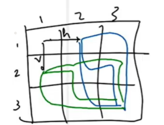

AM

1.  Get Maze Path
Ans :

hhvv

hvhv

hvvh

vhhv

vhvh

vvhh

*\#include* \<iostream\>

using namespace std;

*\#include* \<bits/stdc++.h\>

void fun(int i, int j, int m, int n, string psf)

{

  *if* (i == m - 1 and j == n - 1) {

    cout \<\< psf \<\< endl;

  }

  *if* (i == m or j == n) *return*;

*  // horizental*

  fun(i, j + 1, m, n, (psf + "h" ));

*  // vertical*

  fun(i + 1, j, m, n, (psf + "v"));

}

int main()

{

  int row = 3, col = 3;

*  // \[...\]*

*  // \[...\]*

*  // \[...\]*

  fun(0, 0, row, col, "");

  *return* 0;

}

==================================================
2.  Get Maze Path with jump :
Maze can jump upto -\> col or row end

Ans:

h1h1v1v1

h1h1v2

h1v1h1v1

h1v1v1h1

h1v1d1

h1v2h1

h1d1v1

h2v1v1

h2v2

v1h1h1v1

v1h1v1h1

v1h1d1

v1h2v1

v1v1h1h1

v1v1h2

v1d1h1

v2h1h1

v2h2

d1h1v1

d1v1h1

d1d1

d2

*\#include* \<iostream\>

using namespace std;

*\#include* \<bits/stdc++.h\>

void fun(int i, int j, int m, int n, string psf)

{

  *if* (i == m - 1 and j == n - 1) {

    cout \<\< psf \<\< endl;

  }

  *if* (i == m or j == n) *return*;

*  // horizental*

  *for* (int jump = 1; jump \< n - j; jump++)

    fun(i, j + jump, m, n, (psf + "h" + to_string(jump)));

*  // vertical*

  *for* (int jump = 1; jump \< m - i; jump++)

    fun(i + jump, j, m, n, (psf + "v" + to_string(jump)));

*  // diagonal*

  *for* (int jump = 1; jump \< n - j && jump \< m - i; jump++)

    fun(i + jump, j + jump, m, n, (psf + "d" + to_string(jump)));

}

int main()

{

  int row = 3, col = 3;

  fun(0, 0, row, col, "");

  *return* 0;

}

