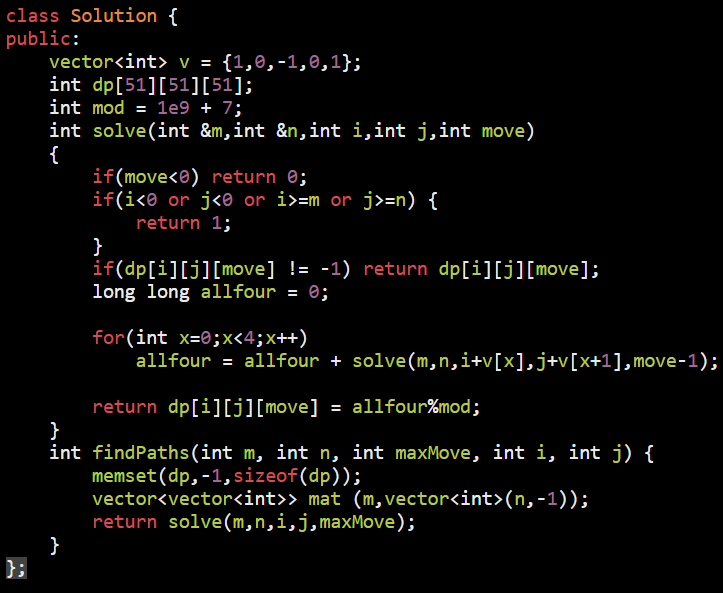

AM

<table>
<colgroup>
<col style="width: 37%" />
<col style="width: 62%" />
</colgroup>
<thead>
<tr class="header">
<th>
<a href="https://leetcode.com/problems/number-of-islands/">200. Number of Islands</a>

<strong>Input:</strong> grid = [ 
["1","1","0","0","0"], 
["1","1","0","0","0"], 
["0","0","1","0","0"], 
["0","0","0","1","1"] 
]

<strong>Output:</strong> 3

<table>
<colgroup>
<col style="width: 16%" />
<col style="width: 83%" />
</colgroup>
<thead>
<tr class="header">
<th>
TC =

0(n)
</th>
<th>bcoz in worst case we traverse a cell 5 times once while processing and 4 time while coming back from adjecent cell calls</th>
</tr>
</thead>
<tbody>
<tr class="odd">
<td>SC = 0(m*n)</td>
<td>
stack space =

so at max it will be no of m*n as we can triverse like snake
</td>
</tr>
</tbody>
</table>

</th>
<th>

</th>
</tr>
</thead>
<tbody>
<tr class="odd">
<td>
<a href="https://leetcode.com/problems/island-perimeter/">463. Island Perimeter</a>

find water area

Input: grid = [[0,1,0,0],

[1,1,1,0],

[0,1,0,0],

[1,1,0,0]]

Output: 16

Ans = 16
</td>
<td>

</td>
</tr>
<tr class="even">
<td>
<a href="https://leetcode.com/problems/max-area-of-island/">695. Max Area of Island</a>

Area = 6; problem occer at but i hendle it
</td>
<td>

</td>
</tr>
<tr class="odd">
<td>
<a href="https://leetcode.com/problems/surrounded-regions/">130. Surrounded Regions</a>

Approch 1 = Move on boundry and mark them as 'M'

</td>
<td>
Run on Boundery

if(i * j == 0 || i == b.size() - 1 || j == b[i].size() - 1)

</td>
</tr>
<tr class="even">
<td>
<a href="https://leetcode.com/problems/out-of-boundary-paths/">576. Out of Boundary Paths</a>

</td>
<td>

</td>
</tr>
<tr class="odd">
<td>
<a href="https://leetcode.com/problems/number-of-closed-islands/">1254. Number of Closed Islands</a>

</td>
<td>

class Solution {

public:

  vector&lt;int&gt; v = {-1,0,1,0,-1};

  void dfs(vector&lt;vector&lt;int&gt;&gt; &amp;grid, int i, int j,bool &amp;check)

  {

    if(i &lt; 0 or j &lt; 0 or i &gt;= grid.size() or j &gt;=grid[0].size()) {

      check = false;

      return;

    }

    if(grid[i][j] == 1) return ;

    grid[i][j] = 1;

    for(int x=0;x&lt;4;x++){

      int ni = i + v[x], nj = j + v[x+1];

      dfs(grid,ni,nj,check);

    }

  }

  int closedIsland(vector&lt;vector&lt;int&gt;&gt;&amp; grid) {

    int cnt = 0;

    for(int i=0;i&lt;grid.size();i++){

      for(int j=0;j&lt;grid[0].size();j++){

        if(grid[i][j] == 0){

          bool check = true;

          dfs(grid,i,j,check);

          if(check) cnt++;

        }

      }

    }

    return cnt;

  }

};
</td>
</tr>
</tbody>
</table>

