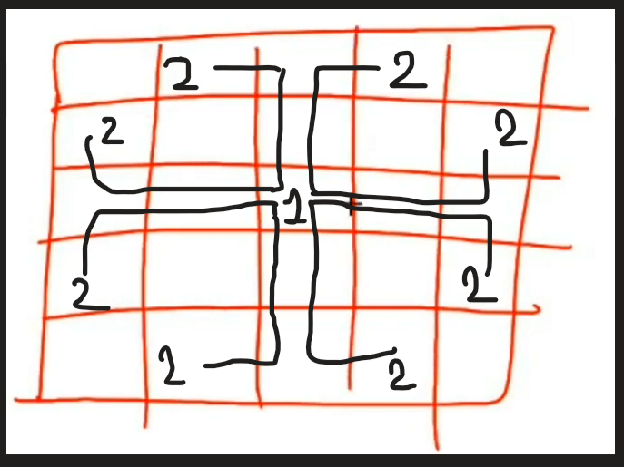

*\#include* \<iostream\>
using namespace std;
*\#include* \<bits/stdc++.h\>
vector\<pair\<int, int\>\> knight_move = {
  { -2, 1}, { -1, 2}, {1, 2}, {2, 1},
  {2, -1}, {1, -2}, { -1, -2}, { -2, -1}
};
void print_board(vector\<vector\<int\>\> &board) {
  *for* (auto && i : board)
  {
    *for* (auto && j : i) cout \<\< j \<\< " ";
    cout \<\< endl;
  }
  cout \<\< endl;
}
void knight_tour(vector\<vector\<int\>\> &board, int row, int col, int move)
{
  *if* (row \< 0 or col \< 0 or row \>= board.size() or col \>= board\[0\].size() or board\[row\]\[col\] != 0) *return*;
  board\[row\]\[col\] = move;
  *if* (move == board.size()\*board\[0\].size()) print_board(board);
  *for* (auto dx : knight_move) {
    knight_tour(board, row + dx.first, col + dx.second, move + 1);
  }
  board\[row\]\[col\] = 0;
}
int main()
{
  int row, col;
  row = col = 5;
  vector\<vector\<int\>\> board(row, vector\<int\> (col, 0));
  *for* (auto && i : board)
  {
    *for* (auto && j : i) cout \<\< j \<\< " ";
    cout \<\< endl;
  }
  cout \<\< "============" \<\< endl;
  knight_tour(board, 0, 0, 1);
  *return* 0;
}

Ans = totel_ans = 304 ans;

0 0 0 0 0
0 0 0 0 0
0 0 0 0 0
0 0 0 0 0
0 0 0 0 0
============
1 20 17 12 3
16 11 2 7 18
21 24 19 4 13
10 15 6 23 8
25 22 9 14 5

1 18 23 12 3
16 11 2 7 22
19 24 17 4 13
10 15 6 21 8
25 20 9 14 5

