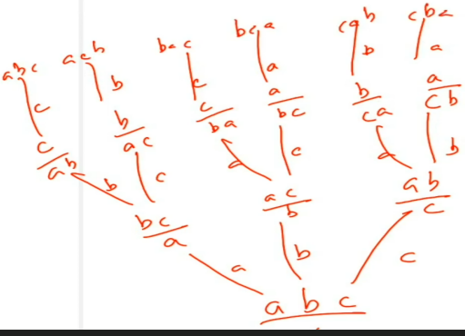
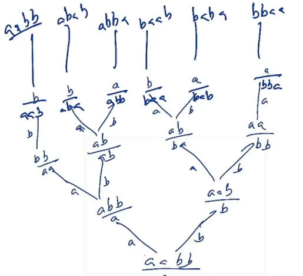

*\#include* \<iostream\>

using namespace std;

*\#include* \<bits/stdc++.h\>

void permutations2(string &s, string &tem)

{

  *if* (tem.size() == s.size()) {

    cout \<\< tem \<\< endl;

    *return*;

  }

  *for* (int i = 0; i \< s.size(); ++i)

  {

    *if* (s\[i\] != '\*')

    {

      char ch = s\[i\];

      s\[i\] = '\*'; // to show it is used

      tem += ch;

      permutations2(s, tem);

      tem.pop_back();

      s\[i\] = ch;

    }

  }

}

int main()

{

  string s = "abc";

  string tem = "";

  permutations2(s, tem);

  *return* 0;

}

Ans =

abc

acb

bac

bca

cab

cba

1.  Permutation when ( All unique )

2.  Permutation (Dublicate exist)

permutations ( distinct integers )

TC = n!(as genrating premutation) \* n (for interating on arr every time)

SC = 0(n) tem for single result + 0(n) for visited

reduced space

