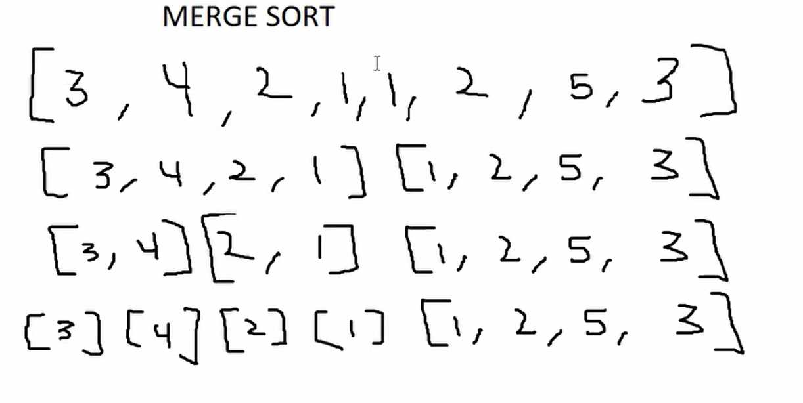

AM

using namespace std;
\#include \<bits/stdc++.h\>

void Merge(vector\<int\> &left, int ls, vector\<int\> &right, int rs, vector\<int\> &arr)
{
  int i = 0, j = 0, k = 0;
  while (i \< ls && j \< rs)
  {
    left\[i\] \< right\[j\] ? arr\[k++\] = left\[i++\] : arr\[k++\] = right\[j++\];
  }
  while (i \< ls) {
    arr\[k++\] = left\[i++\];
  }
  while (j \< rs) {
    arr\[k++\] = right\[j++\];
  }
}
void MergeSort(vector\<int\> &arr, int n)
{
*  // divide in 2 sub array*
  if (n \< 2) return;
  int mid = n / 2;
  vector\<int\> left(mid), right(n - mid);
  for (int i = 0; i \< mid; i++) left\[i\] = arr\[i\];
  for (int i = mid; i \< n; i++) right\[i - mid\] = arr\[i\];
  MergeSort(left, mid);
  MergeSort(right, n - mid);
  Merge(left, left.size(), right, right.size(), arr);
}
int main()
{
  vector\<int\> arr = {1 , 20, 6, 7, 5, 8, 11, 3};
  int n = arr.size();

  MergeSort(arr, n);
  for (int atom : arr) cout \<\< atom \<\< " ";
  return 0;
}

How Merge sort Works ?

*=======================================================================*

*\#include* \<iostream\>
using namespace std;
void Merge(int \*a, int \*l, int nl, int \*r, int nr)
{
  int i = 0, j = 0, k = 0; *//i-\>l\[\] //j-\>r\[\] //k-\>a\[\]*
  *while* (i \< nl && j \< nr)
    (l\[i\] \<= r\[j\]) ? a\[k++\] = l\[i++\] : a\[k++\] = r\[j++\] ;
  *while* (i \< nl) a\[k++\] = l\[i++\];
  *while* (j \< nr) a\[k++\] = r\[j++\];
}
void MergeSort(int \*a, int n)
{
  *if* (n \< 2) *return* ;
  int mid = n / 2;
  int \*l = new int\[mid\];
  int \*r = new int\[n - mid\];
  *for* (int i = 0; i \< mid ; i++) l\[i\] = a\[i\];
  *for* (int i = mid; i \< n ; i++) r\[i - mid\] = a\[i\];
  MergeSort(l, mid);
  MergeSort(r, n - mid);
  Merge(a, l, mid, r, n - mid);
  delete (l);
  delete (r);
}
int main()
{
  int a\[\] = {6, 2, 3, 1, 9, 10, 15, 13, 12, 17};
  int n = sizeof(a) / sizeof(a\[0\]);
  MergeSort(a, n);
  *for* (int atom : a) cout \<\< atom \<\< " ";
  *return* 0;
}

=====================================================================
Inversion : In arr -\> i\<j && arr\[i\]\>arr\[j\] count all cases

*\#include* \<iostream\>
using namespace std;
void Merge(int \*a, int \*l, int nl, int \*r, int nr, int &cnt)
{
  int i = 0, j = 0, k = 0; *//i-\>l\[\] //j-\>r\[\] //k-\>a\[\]*
  *while* (i \< nl && j \< nr)
  {
    *if* (l\[i\] \<= r\[j\])
    {
      a\[k++\] = l\[i++\];
    } *else* {
      cnt += (nl - i);
      a\[k++\] = r\[j++\] ;
    }
  }
  *while* (i \< nl) a\[k++\] = l\[i++\];
  *while* (j \< nr) a\[k++\] = r\[j++\];

  *for* (int i = 0; i \< nl; i++) cout \<\< l\[i\] \<\< " "; cout \<\< "\|";
  *for* (int i = 0; i \< nr; i++) cout \<\< r\[i\] \<\< " "; cout \<\< "\|";
  cout \<\< "cnt = " \<\< cnt \<\< endl;
}
void MergeSort(int \*a, int n, int &cnt)
{
  *if* (n \< 2) *return* ;
  int mid = n / 2;
  int \*l = new int\[mid\];
  int \*r = new int\[n - mid\];
  *for* (int i = 0; i \< mid ; i++) l\[i\] = a\[i\];
  *for* (int i = mid; i \< n ; i++) r\[i - mid\] = a\[i\];
  MergeSort(l, mid, cnt);
  MergeSort(r, n - mid, cnt);
  Merge(a, l, mid, r, n - mid, cnt);
  delete (l);
  delete (r);
}
int main()
{
  int a\[\] = {1 , 20, 6, 7, 5, 8, 11, 3};
  int n = sizeof(a) / sizeof(a\[0\]);
  int cnt = 0;
  MergeSort(a, n, cnt);
  cout \<\< cnt \<\< endl;
  *for* (int atom : a) cout \<\< atom \<\< " ";
  *return* 0;
}

1 \|20 \|cnt = 0
6 \|7 \|cnt = 0
1 20 \|6 7 \|cnt = 2
5 \|8 \|cnt = 2
11 \|3 \|cnt = 3
5 8 \|3 11 \|cnt = 5
1 6 7 20 \|3 5 8 11 \|cnt = 13
13
1 3 5 6 7 8 11 20

