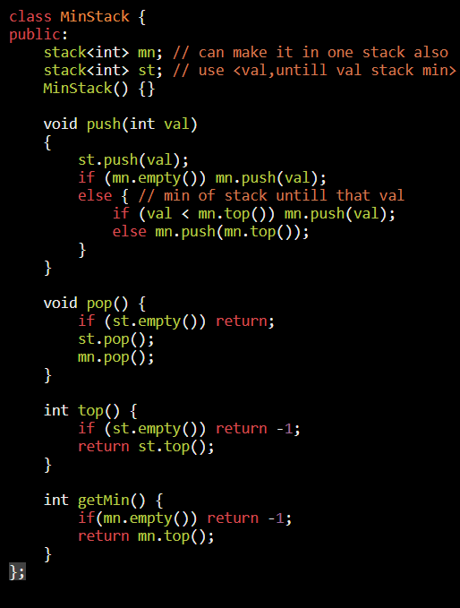

AM

<table>
<colgroup>
<col style="width: 47%" />
<col style="width: 52%" />
</colgroup>
<thead>
<tr class="header">
<th>
<strong>Input</strong> 
["MinStack","push","push","push",

"getMin","pop","top","getMin"] 
[[],[-2],[0],[-3],[],[],[],[]]

<strong>Output</strong> 
[null,null,null,null,-3,null,0,-2]

<strong>Explanation</strong> 
MinStack minStack = new MinStack(); 
minStack.push(-2); 
minStack.push(0); 
minStack.push(-3); 
minStack.getMin(); // return -3 
minStack.pop(); 
minStack.top(); // return 0 
minStack.getMin(); // return -2
</th>
<th>

</th>
</tr>
</thead>
<tbody>
</tbody>
</table>
