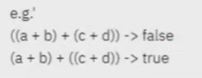
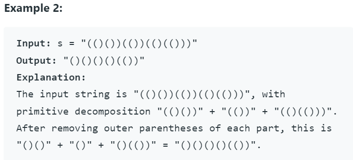

AM

<table>
<colgroup>
<col style="width: 50%" />
<col style="width: 49%" />
</colgroup>
<thead>
<tr class="header">
<th><ol start="2" type="1">
<li>
Duplicate Brackets
</li>
</ol>
<blockquote>

string is bal : just check if extra pair of bracket is present or not

</blockquote></th>
<th>
<em>for</em>(auto i: str)

{

  <em>if</em>(i == closing) {

    <em>if</em> top is opening : <em>return</em> true;

    <em>else</em> {

      remove all uptill opening

      &amp; remove closing

    }

  }

  <em>else</em> {

    st.push(i);

  }

  <em>return</em> false;

}
</th>
</tr>
</thead>
<tbody>
<tr class="odd">
<td><ol start="3" type="1">
<li>
<a href="https://leetcode.com/problems/remove-outermost-parentheses/">Remove OuterMost parentheses - easy</a>
</li>
</ol>
<blockquote>

// primitive decomposition concept when cnt == 0

// it means string of paren decomposed

</blockquote></td>
<td>

</td>
</tr>
</tbody>
</table>

D
