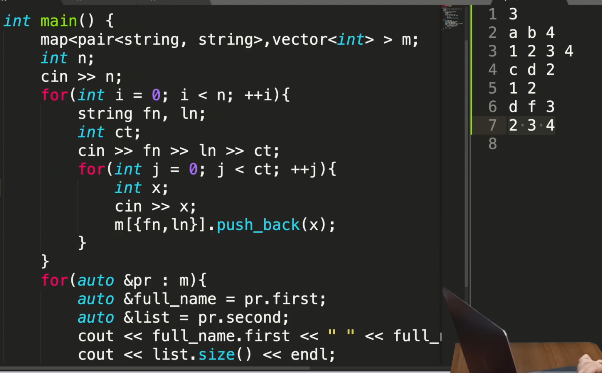

AM

1.  ***EverydatatypeinSTLis comparable***
 *p1={2,3};p2={2,4};*****
***//initially.firstof both compare***
***ifequalthen.secondcompare***

2.  ***take input of no. of stud \| fn \| ln \| arr of***
***marks in given no. of sub***

3.  
