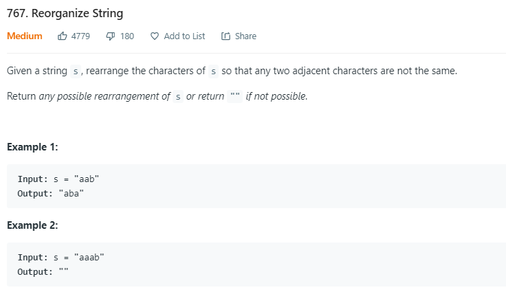

<table>
<colgroup>
<col style="width: 55%" />
<col style="width: 44%" />
</colgroup>
<thead>
<tr class="header">
<th>

Place : odd &amp; even position

<table>
<colgroup>
<col style="width: 28%" />
<col style="width: 71%" />
</colgroup>
<thead>
<tr class="header">
<th>map</th>
<th>most freq push back</th>
</tr>
</thead>
<tbody>
<tr class="odd">
<td>
a-3 2 1

b-1 0 0

c-1 1 0
</td>
<td>
a -&gt; ab -&gt; abac

while() abaca
</td>
</tr>
</tbody>
</table>

</th>
<th>

</th>
</tr>
</thead>
<tbody>
</tbody>
</table>
