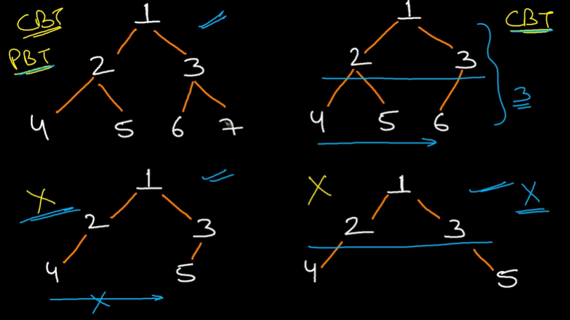
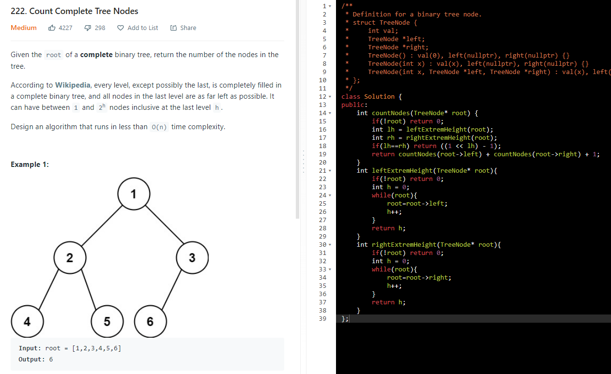

AM

For CBT
no of nodes = 2^level - 1
height = log(n)

Try to Reduce TC 0(n) by using property of CBT

1.  Count nodes in CBT

h = log(N)

TC =\>
Best case = log(N) CBT to find lh = log n & rh = log n
Wrost case = log(N)^2
prev level will be fill and last level has one node its worst ca

log(N) to triverse till leftExtrime and log n to find lh

SC =\> h = log(N) stack space
