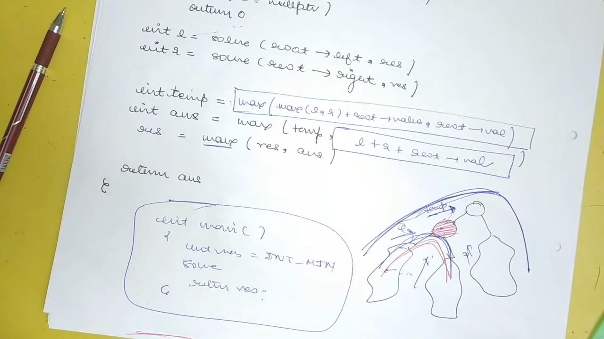

1.  Base Code :

  int solve(node\* root,int &res){
    if(!root) return 0;
    int l = solve(root-\>left,d);
    int r = solve(root-\>right,d);
    int temp = condition ; * // case 1 : I will pass the best*
    int ans = max(temp,releation); *// case 2 : I am real ans*
    res = max(res,ans);
    return temp;
  }

1.  Dimeter \| From leaf to leaf is dimeter
Longest Distence between any two nodes
  int dimeter(node\* root,int &d){
    if(!root) return 0;
    int l = dimeter(root-\>left,d);
    int r = dimeter(root-\>right,d);
    int temp = max(l,r) + 1; * // case 1 : I will pass the best*
    int ans = max(temp,l+r+1); *// case 2 : I am ans*
    d = max(d,ans);
    return temp;
  }

2.  Maximum Path Sum \| From any Node to any
only problem with -ve value in tree

  int max_path_sum(node\* root,int &res){
    if(!root) return 0;
    int l = max_path_sum(root-\>left,res);
    int r = max_path_sum(root-\>right,res);
    int temp = max(max(l,r) + root-\>val,root-\>val);
*// it will choose best (but what if both are -ve therefor max(max used))*
    int ans = max(temp,l+r+root-\>val); *// case 2 : if I am ans*
    res = max(res,ans);
    return temp;
  }

3.  Max Path Sum \| From leaf to leaf

