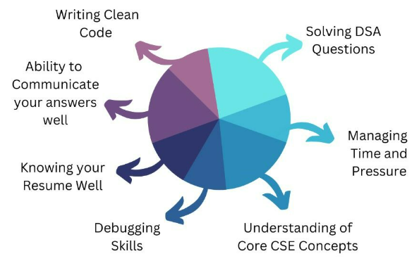

1\) put focus on constraints while solving the problem, it's not just for show, it tells a lot about what approach will work for solving the problem.

2\) in interviews ask interviewer more about the problem with a sample case, straight jumping to a solution with half knowledge about problem is not advisable!

🎯 Code Readability: The code you write should be readable and must follow good coding practices.

🎯 Know your Resume Well: Revise topics from each and every section of your resume, you must know atleast what's written in it. Try to prepare a story behind every point you've written in your resume.

