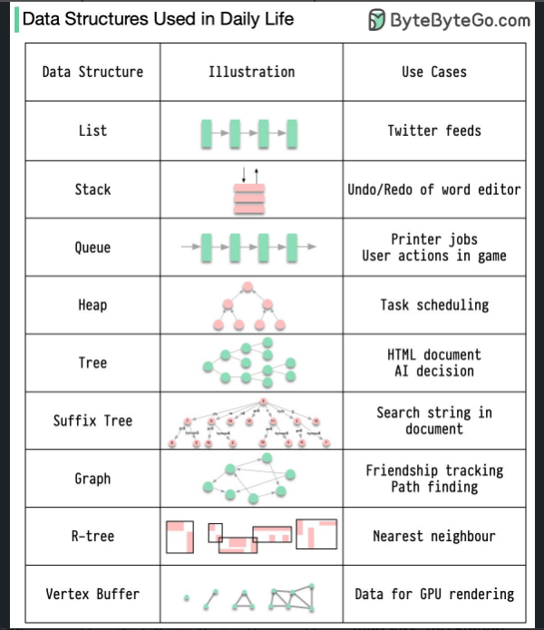

**Linked List**
1.  we Mostly use Doubly Linked list
2.  Image Gallary (shift right and left)
3.  Music Player next and prev song
4.  Browsers (prev page next page)
5.  Stack & queue
6.  Hash Map Hash Set
7.  In the ludo game, It has to pass the chance to each player in a circular fashion (circular linked list).

**Stack**
1.  undo/Redo
2.  system stack for ativation record
3.  balanced parenthesis
4.  Infix prefix postfix expression evaluation
5.  DFS
6.  Recursion

**Queue**
1.  CPU scheduling disk scheduling
2.  In real life call center phone system ( people wait in hold until one service representative get free.
3.  Mail delivery system
4.  Your browser deletes the history past one month.
5.  Serving req on a single shared resouses
eg. printer, cpu sheduling, disk sheduling etc

**Tree**
1.  File system: Folders and subfolders (N-ary tree).
2.  e-commerce websites : category -\> subcategories -\> products
3.  Auto-suggestion when you google (Trie)

**Graphs:**
1.  Uber, Ola cab booking: show nearest available cars (BFS)
2.  Maven dependencies build order ( Topological sorting (DFS))
3.  While booking bus/flights, you get a list of available routes.
4.  InFacebook, users are considered to be the vertices and if they are friends then there is an edge running between them. Facebook’s Friend suggestion algorithm uses graph theory. Facebook is an example ofan undirected graph.

