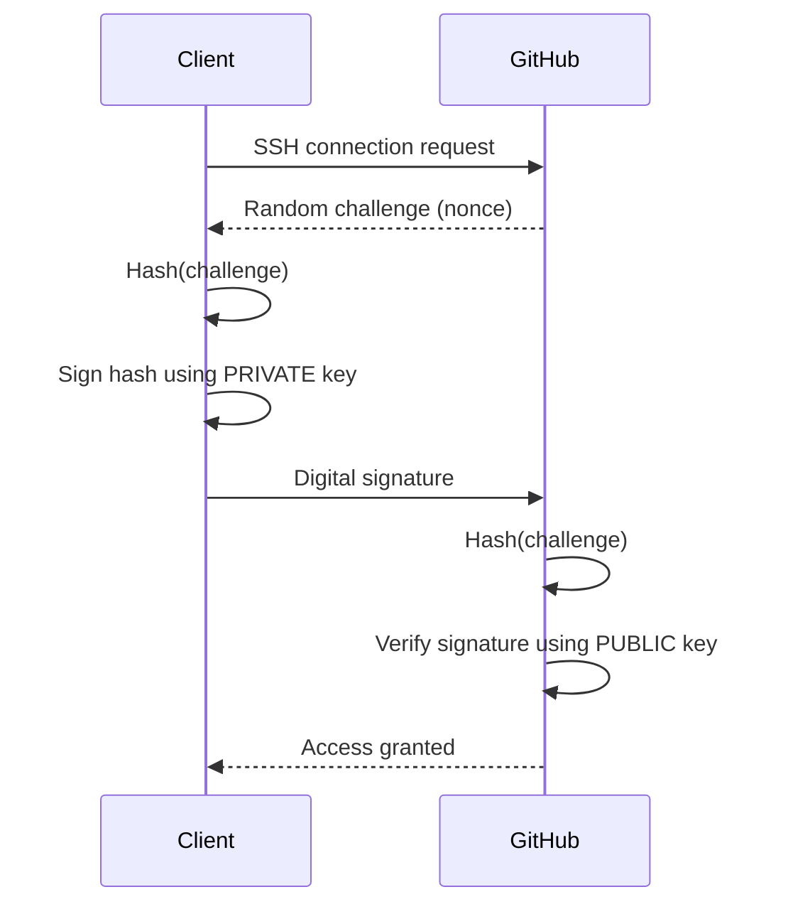

---

# 🔐 SSH with Public & Private Keys  |  Git SSH

## 1️⃣ What SSH Does

- **SSH (Secure Shell)** provides:
    - Secure authentication
    - Encrypted communication
- Used by **GitHub** for password-less Git access

---

## 2️⃣ Key Concept (Asymmetric Crypto)

- SSH uses **two mathematically linked keys**
    - 🔑 **Private key** → stays on your machine  →  **Decrypt**  →  In new world -  Sign Challenge with PRIVATE key
    - 🔓 **Public key** → stored on GitHub →  **Encrypt**  →  In new world - Verify Signature with PUBLIC key
- Private key is **never shared**
- 📌 **Important correction** Encrypt / Decrypt is **NOT** used for SSH authentication

---

## 3️⃣ Generate an SSH Key (Default Location)

`ssh-keygen -t ed25519 -C "your_email@example.com"`

SSH key algorithm:`ed25519` ✅ (secure + fast)

```
~/.ssh/
├─ id_ed25519        # Private key
└─ id_ed25519.pub    # Public key
```

> [!danger]
> Never commit or share the private key → Keep it on client side

---

## 4️⃣ Authentication Flow (How It Works)


- 📌 Only client can create the signature
- 📌 Both client and server can compute the hash, they use same hash algorithem

## 5️⃣ Why Old Videos Say “Decrypt”

Older SSH (RSA-based) **could** do encryption/decryption, so videos explain it as:

> “Server encrypts challenge, client decrypts it”

But this is **outdated**.

### Modern SSH (Reality)

- Uses **digital signatures**
- Does **NOT** decrypt challenges
- Keys like `ed25519`:
    - ❌ Cannot decrypt
    - ✅ Can only **sign / verify**


📌 **“Sign with Private Key” means**

> Creating a **digital signature** that only the private key owner can produce

---

## 5️⃣ What  - Encryption After Authentication

- Public/Private keys:
    - ✅ **Authentication** - Keys Are Actually Used For THIS 
    - ❌ **Not used for full data encryption**
- After authentication:
    - A **session key** is created
    - All data is encrypted using that session key

---

## 6️⃣ SSH: EC2 vs GitHub (One-Line)

```
Same SSH authentication → different permissions
EC2     → full server (shell) access
GitHub  → Git operations only (clone, pull, push)
```

---
